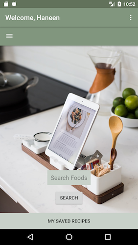
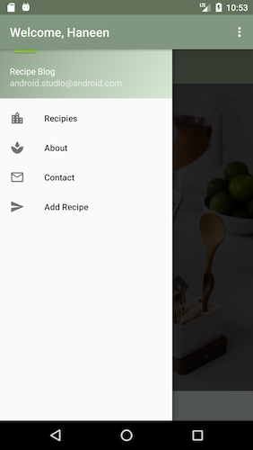

# Recipe Blog

#### Epicodus Friday Project

#### By Haneen Abu-Khater

## Table Of Contents

* [Description](#description)
* [Sample Application](#view-of-application)
* [Set-Up Requirements](#setup-requirements)
* [Specifications](#specifications)
* [Questions/Concerns](#questions-or-concerns)
* [Known Bugs](#known-bugs)
* [Technologies Used](#technologies-used)

## Description

_This application will allow communities to share recipe blogs. When user selects to view recipes they are shown Paleo specific recipes. Later they will be able to contribute their own healthy recipes_


## Sample Application

_HomePage View_



_Navigation Drawer Menu_



_Recipe List_


_Detail View_


## Setup Requirements

_To use this project, you will need to make sure to install Android Studio._
* [Android Studio](https://developer.android.com/studio/index.html)
* After it has been installed, you will be able to open the application.

_To use this application, you will need to generate an API Key_
* You will need to get an API Key from
  * [Yummly](https://developer.yummly.com/#plans)
  * Create an acedemic plan for free to get your API key
  * All documentation on how to use the API is also present [there](https://developer.yummly.com/documentation).

* Clone the repo from git hub using:
````
$ git clone https://github.com/haneenabu/RecipeBlog.git
````
* Open the application in Android Studio.
* Experiment!

* Open in your favorite emulator (preferred version 23).


## User Stories
* As a user, I want to be able to create a recipe blog.
* As a user, I want to be able to contact the owner of the application if something goes wrong.
* As a user, I want to be able to login to a previously created account.
* As a user, I want to be able to be able to see a list of recipes.
* As a user, I want to be able to add my own recipe to share with the community (Not yet functional)
* As a user, I want to be able to see an about page.
* As a user, I want to save my favorite reciped in a list.


## Questions or Concerns ##
_If there are any questions or concerns, please contact me at abukhater.haneen@gmail.com_

## Known Bugs
* The add recipe functionality doesn't work yet.
* Images don't appear in the detail view of the recipe yet.
* Search feature doesnt work 100% yet.


## Technologies Used

* _Android Studio_
* _Atom_
* _Postman_
* _Firebase_


### License

Copyright &copy; 2017 Haneen Abu-Khater
